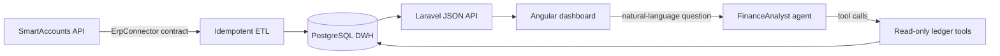

# gatto — real-time ledger intelligence

A vertical slice of an accounting-automation platform: pull a client's ledger from
an ERP, normalize it into a warehouse, and answer finance questions about it in
plain language. Built end-to-end on the 2026 stack (Laravel 13, Angular 20,
Laravel AI SDK) — modelled on a real Estonian public-sector procurement brief.

**Live demo:** https://gatto-piccolo.com


## What it does
- Ingests a chart of accounts + journal entries from **SmartAccounts** (Estonian
  accounting software) through a typed connector contract.
- Normalizes everything into a **PostgreSQL data warehouse** (an XBRL-GL-style
  ledger) via an idempotent, event-driven ETL.
- Serves a **dashboard** (monthly revenue/expenses/profit, per-account breakdown)
  with English/Estonian i18n.
- Answers natural-language questions ("what was the cashflow in March?") with an
  **AI agent** that calls read-only, tenant-scoped tools over the warehouse — so
  figures come from the database, never from the model.

## Architecture


## Design decisions
- **Connector contract** — SAF/Erply/Directo plug in as more implementations of one
  interface; the ETL never changes. A `Fake` connector seeds realistic data so the
  whole pipeline runs without API keys.
- **Idempotency** — entries are keyed by source ref; re-syncing never duplicates.
- **Tool-calling, not text-to-SQL** — the model picks which tested aggregate to run;
  it cannot invent numbers or inject SQL, and every read is scoped to `tenant_id`.
- **i18n-ready** — all UI strings live in a dictionary; adding a language is one entry.
- **Tested without the LLM** — the deterministic core (ETL + `LedgerQuery`) carries
  the correctness guarantees, so CI is green with no secrets.

## Run locally
API:
```bash
cd api && composer install
cp .env.example .env && php artisan key:generate   # set DB + ANTHROPIC_API_KEY
php artisan migrate && php artisan erp:sync
php artisan serve
```
Dashboard:
```bash
cd dashboard && npm install
ng serve --proxy-config proxy.conf.json
```

## Test
```bash
cd api && php artisan test
```

## Deploy
See [DEPLOY.md](DEPLOY.md) — nginx + php-fpm + PostgreSQL + Let's Encrypt on a single VPS.

## Context
Modelled on the GROW Finance procurement brief (real-time economy, universal data
model, ERP integration, MTA machine-to-machine filing, AI-assisted reporting). This
repo implements one end-to-end slice of that scope as a portfolio piece.
